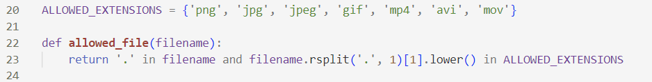

# **ПРОШИРЕНА ИМПЛЕМЕНТАЦИЈА НА АЛГОРИТАМОТ ЗА ДЕТЕКЦИЈА НА ЛИЦЕ ВО СЛИКА И ВИДЕО, ВО ВЕБ СТРАНА**

# Изработил: Давор Младеновски, индекс бр. 226042

# **Апстракт**
Во оваа семинарска работа ќе биде детално
објаснет начинот на функционирање на веб-страна за детекција и
препознавање на лице во слика и видео. Проектот е составен од неколку
дела: HTML фајлови, за дизајнот на страната, CSS фајл со чија помош се
поставува стилот на претходно дефинираните елемнти во HTML фајловите,
JavaScript скрипти, кои дефинираат настани што се случуваат додека
корисникот изведува одредени потези во рамки на самата страна и Python
скрипта со која се врши детекцијата и препознавањето на лице, како и
самото управување на веб апликацијата со помош на Flask. Секој од
горенаведените делови ќе биде детално објаснет, а објаснувањето ќе биде
поткрепено со слики од веб апликацијата, како и делови од самиот код.

# **1. Вовед**

Во современиот дигитален свет кој постојано се повеќе напредува,
интеграцијата на софистицираните дигитални модели и алатки како и
користењето на вештачката интелигенција станаа суштински и еден од
незаменливите делови од нашето секојдневие. Мноштвото паметни уреди кои
беа развиени и лансирани на пазарот во последните неколку години го
револуционализираа начинот на кој човекот комуницира со светот околу
него. Едно од најголемите технолошки достигнувања кое привлече големо
внимание поради широкиот опсег на употреба и можноста за прилагодување
во различни типови на системи е [технологијата за детекција и
препознавање на лице].

Технологијата за детекција и препознавње на лице во денешницата е
составен дел на повеќе аспекти на модерниот живот. Таа игра една од
главните улоги во безбедносните системи за следење и контрола на
пристап, исто така голем дел од современите апликации и уреди ја
користат за брза и едноставна идентификација на корисниците. Овој тип на
технологија примената може да ја најде и во други области, како што се
здравството, маркетинг кампањите, забавната индустрија и слично. Со
употреба на технологијата за детекција и препознавање на лице на
корисникот му се овозможува подобро корисничко искуство, но пред се
нивото на сигурност при користење на софтверот се става на многу
повисоко ниво.

Главната цел на алгоритмите кои спроведуваат детекција и препознавање на
лице е давање способност на машината да интрепретира визуелни податоци,
како што се слики и видеа, потоа секое човечко лице кое се наоѓа на
влезниот визуелен податок да биде детектирано, за на крај да биде
идентификувано. За детекцијата и идентификацијата да бидат успешно
спроведени потребни се сложени алгоритми, но исто така и големи збирки
на податоци кои ќе бидат искористени за да го добиеме посакуваниот
резултат.

## Мотив

Мотивацијата за изработка на семинарска работа, токму на оваа тема, ја
добив од широката употреба на алгоритмите за детекција и препознавање на
лице од страна на компанијата "Apple" кај повеќето од нивните уреди.
Желбата за истражување и учење на овие технологии и алгоритми
дополнително ја хранеа мојата мотивација и желба за работа во текот на
целиот процес на изработка.

## Цел

Главната цел на самата апликација која ја имплементирав е да му се
овозможи на корисникот лесно, едноставно и брзо со прикачување на слика
или видео да бидат детектирани и откриени сите личности кои се наоѓаат
на самиот визуелен запис.

# **2. План на веб-апликацијата**

Како главен и основен чекор при креирање на веб апликацијата е
планирањето, односно креирање план за развој на апликацијата. Тој
вклучува, дефинирање на целта која сакаме да ја постигнеме, опсегот кој
ќе биде опфатен како и сите функционалности кои апликацијата ќе ги нуди.

Секој корисник кој ќе пристапи до веб апликацијата првенствено ќе се
сретне со лесен и едноставен интерфејс за користење, што и првично беше
мојата цел. Со притискање на еден клик тој прикачува слика или видео, а
потоа истите се обработуваат од страна на алгоритамот за детекција и
препознавање на лице, а на корисникот му се прикажува резултатот на
екран. Корисникот го добива посакуваното решение, односно доаѓа до целта
брзо, лесно и едноставно.

## 2.1 Палета на бои

Во процесот на креирање на веб-страна за една веб апликација, секогаш
мора да се определи кои бои ќе бидат употребени за интерфејсот да биде
пријатен за окото на корисникот, но истовремено привлечен и доволно
јасен.

## 

Како и во секоја сфера, така и во веб дизајнот постојат трендови кои
мора да се почитуваат. Нивното следење е од суштинско значење за
создавање визуелно привлечен кориснички интерфејс. Во моментов, поголем
дел од веб апликациите користат црна или бела како примарна боја, која
се користи за позадината на веб страната. Со користење на овие две бои
се постигнува минималистички и професионален изглед.

За мојата веб-апликација прецизно избрав посветла нијанса на црна боја
*#191919hex*, со користење на оваа нијанса како примарна боја се
постигнува совршена рамнотежа помеѓу острината која ја дава црната боја
и удобноста која е потребна за да се избегне преоптоварување на
корисникот.

Покрај примарната боја, изборот на секундарна боја која ќе се користи за
насловите и текстот е подеднакво важен. Во рамки на мојата
веб-апликација избрав две секундарни бои:

-   *#D1D1D1hex* светло сива боја користам за текстот. Оваа суптилна
    нијанса овозможува одличен контраст со позадината, осигурувајќи дека
    текстот ќе биде лесно читлив без да предизвикува оптоварување на
    корисникот, а истовремено се одржува елегантниот и модерен дизајн.

-   *#ECECEChex* посветла нијанса на сиво ја избрав за насловите. Со
    помош на оваа посветла боја се создава јасна визуелна хиерархија,
    корисникот лесно може да ги разликува насловите од текстот па со тоа
    интерфејсот ја задржува својата удобност и читливост.

Овие две секундарни бои потполно се усогласуваат со примарната боја на
позадината, создавајќи избалансиран и софистициран дизајн. За да го
комплетирам дизајнот за крај избрав впечатлива сина боја *#00669Dhex*
која ја користев за сите интерактивни елементи како што се копчиња и
икони. Овој внимателен избор на бои резултираше со модерен, софистициран
и високо функционален кориснички интерфејс.

## 2.2 Организација на директориумот и датотеките

Ефективната организација на директориумот и датотеките е од клучно
значење при развојот и одржувањето на една веб-апликација. Добро
структуираниот проект, не само што го подобрува управувањето со
проектот, туку и му помага на развивачот на софтвер лесно да ги пронајде
бараните датотеки. Покрај тоа, добрата организација придонесува за
зголемената продуктивност при работа како и полесно тимско работење, што
е од особено значење за поголеми проекти.

 При креирање на веб-апликација со помош
на библиотеката Flask во Python мора да се одредат два директориуми од
кои ќе се земаат податоците и датотеките кои ќе се користат. Python
скриптата се наоѓа веднаш во главниот директориум, а потоа имаме и два
директориума, од кои во static се наоѓаат фајловите кои се постојани и
не се менуваат, додека во директориумот templates се наоѓаат HTML
фајловите.

Директориумот static првенствено ги содржи сите слики, како што се
логото и иконите кои се поставени на веб-страната. Потоа имаме два
директориума во кои се сместуваат сликите и видеата кои корисникот ги
прикачува, а потоа истите се обработени од страна на алгоритамот за
детекција и препознавање на лице. Директориумот faces содржи фотографии
од неколку познати личности кои се користат за споредување на нивните
лица со со лицата од прикачената фотографија или видео, а потоа врз база
на тоа споредување се дава решението односно се дава резултатот од
детекцијата. Исто така во овој директориум се наоѓа и style.css
датотеката која го дава стилот на HTML фајловите односно целата
веб-апликација.

Директориумот templates содржи три HTML
фајлови, Home.html е главната почетна страна на апликацијата,
detection.html се појавува тогаш кога корисникот ќе прикачи слика,
додека video_detection.html се појавува тогаш кога корисникот ќе прикачи
видео на кое треба да се изврши детекција на лице.

# **3. Имплементација**

Веб-апликацијата која ја развив се состои од два главни дела: серверски
дел -- Python скриптата која ја врши детекцијата и препознавањето на
лице и клиентски дел -- веб страната која се прикажува на клиентот,
преку која манипулира со елементите и извршува одредени задачи.

## 3.1 Серверски дел ( Back-end )

Серверскиот дел е јадрото на овој проект, без него веб-апликацијата нема
да ги има главните функционалности за кои е наменета. Во овој случај,
серверот е изграден користејќи го Flask, кој претставува лесен и
флексибилен веб-фрејмврок за програмскиот јазик Python. Flask обезбедува
основа за изработка на веб апликации и API-и со минимален код, па затоа
го прави идеален фрејмврок за проект како овој.

Серверот како главна задача има да обработува барања кои ги испраќа
клиентот за поставување на слики и видеа, кои потоа се анализираат и
испраќаат до алгоритмите за детекција и препознавањее на лице. Функциите
кои ја вршат детекцијата на лице detect_faces_image и detect_faces_video
користат две главни библиотеки OpenCV и face_recognition. Овие две
функции користат претходно обучени модели за препознавање на лица и ги
прикажуваат резултатите со цртање на правоаголници околу препознаените
лица заедно со нивните имиња и нивото на точност при препознавањето.

Веб-апликацијата исто така нуди можност клиентот да го контактира
администраторот преку мејл форма кој е поврзана со серверскиот дел.
Серверот испраќа е-пошта преку Gmail SMTP серверот, со тоа се овозможува
корисникот да поставува прашања директно преку веб-апликацијата, со што
се подобрува корисничкото искуство и се овозможува полесна комуникација.

Со помош на серверскиот дел се обезбедува стабилна и сигурна основа за
главните функционалности на овој проект.

### 3.1.1 Опис на функцијата \`upload_file\`

Една од клучните функции за овој проект е токму функцијата
\`upload_file\` со чија помош се врши обработка на барањата за
прикачување на датотеки во рамки на веб-апликацијата.

Главната задача на оваа функција е обработка на POST и GET методи кои ги
испраќа корисникот до веб-апликацијата, односно кога корисникот ќе го
посети URL-то \`/home\` со GET или POST метод, на пример прикачување на
слика или видео, функцијата ќе биде повикана, ќе ја обработи прикачената
датотека и ќе го врати соодветниот одговор, односно шаблонот со резултат
од детекцијата на лица.

Со прикачување на слика или видео на веб-апликацијата клиентот испраќа
POST барање, па функцијата првенствено проверува дали барањето кое го
испраќа клиентот е од тој тип, а потоа го зема фајлот кој тој го
прикачил и извршува проверка дали екстензијата која ја има фајлот е
дозволена за да се изврши обработка.

Доколку прикачената датотека има една од горенаведените екстензии,
функцијата извршува уште една проверка, дали датотеката е слика или
видео со помош на два if услова.

Ако прикачената датотека има екстензија
што ја карактеризира како слика прво истата се зачувува во претходно
дефиниран директориум во рамки на веб-апликацијата, а потoа се испраќа
до алгоритамот за детекција и препознавање на лице. Доколку добиеме
резултат кој е различен од None, новокреираната слика се зачувува на
истото место како и прикачената, односно се случува преклопување со цел
зачувување на мемориски простор. Врз новодобиената слика се извршува
анализа на сите нејзини атрибути како што се висина, ширина, простор на
бои, големина на фајл и тип на фајл, а потоа сите овие податоци заедно
со сликата се испраќаат до посебен шаблон detection.html кој му се
прикажува на корисникот.

Додека пак процедурата при прикачување на видео е малку покомплицирана.
Видеото кое корисникот го прикачува се зачувува во претходно дефиниран
директориум и пред да се испрати до алгоритамот за детекција на лице се
дефинира патека за резултантното видео кое има екстензија .avi и префикс
processed\_, за потоа да се испрати патеката на прикачената датотека и
патеката на која ќе биде зачуван резултатот од детекцијата како
аргументи во функцијата за детекција. По завршување на детекцијата се
создава објект од типот VideoFileClip на кој потоа му се врши конверзија
од avi во mp4 формат поради тоа што HTML5 подржува само видеа од типот
mp4, додека пак алгоритамот за детекција на лице работи само со видеа од
типот avi. Крајното видео со екстензија mp4 се зачувува на истото место
како и претходните. На крај се врши анализа на новодобиеното видео, а
потоа сите атрибути заедно со видеото се испраќаат до соодветниот шаблон video_detection.html.

### 3.1.2 Опис на функцијата \`detect_faces_image\`

Главната цел на оваа функција е детекција и препознавање на лице во
проследената слика при нејзино повикување. Првично проследената слика се
чита со помош на библиотеката OpenCV и се проверува дали истата постои,
доколку сликата успешно се вчита започнува процесот на детекција. Се
повикува функцијата encode_known_faces со која во две променливи се
сместуваат лицата на сите луѓе кои се наоѓаат во претходнодефинираниот
директориум кој ја содржи колекцијата на лица и нивните имиња. Сликата
се конвертира во сиво (grayscale) за да обезбедиме подобро детектирање и
откривање на лицата, а потоа со помош на функциите од библиотеката
face_recognition се добива локацијата на секое лице и неговите
карактеристики односно се прави енкодирање.

Во циклус се поминуваат сите детектирани лица на сликата и се прави
споредба на веќе познатите лица од директориумот со новодетектираните со
функцијата face_recognition.compare_faces, во овој дел гледаме дали има
поклопување на некои карактеристики. Потоа со помош на функцијата
face_recognition.face_distance се пресметува растојанието на веќе
познатите енкодирани и со ново енкодираните лица на сликата и се наоѓа
најдоброто поклопување со помош на np.argmin. Доколку постои поклопување
на одредени карактеристики и пресметаното растојание е помало од
дозволениот праг на отстапување, името на личноста која е детектирана се
зема од листата на познати имиња, се пресметува степенот на доверба со
помош на функцијата face_confidence, за на крај да се исцрта
правоаголник околу детектираното лице и заедно со името и степенот на
доверба да се испратат како резултат од детекцијата.

### 3.1.3 Опис на функцијата \`detect_faces_video\`

Целта на оваа функција е да се изврши
детекција и препознавање на лица во рамки на прикаченото видео, и ново
креираната рамка да се зачува во ново видео кое подоцна ќе му биде
испратено на корисникот како резултат. Прикаченото видео се вчитува со
помош на библиотеката OpenCV и се проверува дали постои, доколку е
валидно и постоечко се проследува на делот за детекција. Поради тоа што
мора да направиме ново видео со кадрите кои ќе се добијата по
детекцијата, ги земаме ширината и висината на кадарот од влезното
прикачено видео, исто така го земаме и fps од истото и создаваме објект
од класата cv2.VideoWriter кој ќе биде задолжен да ги зачувува новите
кадри од детекцијата со карактеристиките на влезното видео.

Во еден while циклус ги поминуваме сите кадри од видеото, поради тоа што
секој кадар од видеото претставува слика ја имаме истат постапка за
детекција и препознавање на лица со тоа што на крај, новодобиениот кадар
(слика) од детекцијата се запишува во претходнодефинираниот објект за
запишување на кадри. На крај видеото се проследува до корисникот.

### 3.1.4 Опис на функцијата \`send_email \`

 Оваа функција како главна задача има да
управува со пораките кои корисникот сака да ги испрати до е-поштата на
администраторот. Самата функција се активира кога корисникот ќе пристапи
до URL патеката /send_email со POST метод. Сите детали за пораката како
што се е-поштата на корисникот, текстот на порката и subject на мејлот
се земаат директно од формата, а потоа се испраќаат на мејлот на
администраторот. Испраќањето на порката се извршува со помош на SMTP
сервер кој е претходно дефиниран. На крај на корисникот му се прикажува
соодветна порака во зависност од тоа дали пораката е успешно доставена
до администраторот.

### 3.1.5 Библиотеки

Следниве неколку библиотеки се искористени во рамки на Python скриптата
за успешно функционирање на истата:

-   import **mimetypes** -- обезбедува поддршка за мапирање и откривање
    на датотечни екстензии

-   import **os** -- обезбедува функции за интеракција со оперативниот
    систем

-   from email.mime.text import **MIMEText** -- оваа класа се користи за
    создавање на текстуална порака која се испраќа преку е-пошта

-   import **smtplib** -- обезбедува функции за испраќање на е-пошта
    користејќи SMTP

-   from **flask** import Flask, flash, render_template,
    render_template_string, request, redirect, url_for -- креирање на
    веб-апликацијата

-   import **cv2** -- обезбедува функции за обработка на слики и видеа

-   from werkzeug.utils import **secure_filename** -- со помош на оваа
    функција се отстрануваат опасните карактери од имињата на датотеките
    за да се спречи потенцијален безбедносен проблем

-   import **math** -- обезбедува математички функци

-   import **numpy** as np -- обезбедува поддршка за работа со
    повеќедимензонални матрици

-   import **face_recognition** -- обезбедува функции за детекција и
    препознавање на лица во слики и видеа

-   from PIL import **Image** -- обезбедува поддршка за отварање,
    манипулирање и зачувување на различни формати на слики

-   from moviepy.editor import **VideoFileClip** -- обезбедува поддршка
    за работа со видеа, вклучувајќи функции за уредување, манипулирање и
    креирање на видеа.

## 3.2 Клиентски дел ( Front-end )

Клиентскиот дел односно Front-end делот на веб-апликацијата е клучен за
да може да се создаде интерактивен и кориснички ориентиран интерфејс кој
ќе биде пријатен и лесен за користење. Клиентскиот дел е првиот впечаток
што корисникот го добива кога ја посетува веб-страната и затоа е од
големо значење за да може целиот проект да функционира успешно.

Во рамки на оваа веб-апликација јазици кои се користени при креирање на
веб-страна се: HTML, CSS и JavaScript.

### 3.2.1 Home.html

Почетната страна на веб-апликацијата нуди сеопфатни воведни информации
за проектот како и за неговиот администратор. Менито за навигација се
наоѓа на врвот на страницата и овозможува лесен пристап до кој било дел
од страната. Веднаш под менито се наоѓа копче преку кое корисникот
прикачува слика или видео кое потоа се проследува до алгоритамот за
детекција. На почетната страница исто така се наоѓаат и детални
информации за администраторот, проектот како и форма за контакт на
администраторт преку е-пошта. Во рамки на самиот код постојат модални
прозорци кои првично не се гледаат на страната, но при одредени акции
истите се појавуваат.

Error Modal прозорецот се појавува тогаш
кога корисникот ќе прикачи датотека која не е подржана од страна на
системот, па со тоа овој прозорц се појавува за да го извести корисникот
дека направил грешка.

Со неговото појавување односно
непојавување се справува JavaScript функција која проверува присутност
на порака за грешка испратена од страна на Python скриптата.

 Flash Modal прозорецот се појавува како
известување тогаш кога корисникот испраќа порака преку формата за
контактирање на корисникот преку е-пошта. Овој прозорец му кажува на
корисникот дали пораката е успешно испратена до администраторот.

### 3.2.2 detection.html

Оваа HTML страна се вчитува доколку корисникот прикачи слика и воедно
истата е соодветна за да се изврши детекција, резултатот од детекцијата
на лица се прикажува токму овде. Исто и оваа страна ја има навигацијата
на самиот врв.

Во главниот дел на страната се покажува резултантната слика од
детекцијата и нејзините карактеристики кои директно се испраќаат од
Python скриптата.

### 3.2.3 video_detection.html 

Оваа HTML страна е наменета за да се
прикаже обработеното видео кое корисникот го испратил до алгоритамот за
детекција, при што се прикажуваат и неговите карактеристики. Страната
исто така има навигација на врвот.

 

# **Заклучок**

Работата на овој проект значително ги подобри моите вештини во
програмирање со програмскиот јазик Python, особено во домените на
компјутерска визија и обработка на слики. Со негово имплеменитрање
стекнав нови знаења и научив нови техники како да ги искористам
библиотеките OpenCV и face_recognition во процесот на имплементација на
алгоритмите за детекција и препознавање на лице.

Самиот проект може да се користи во повеќе области како што се надзор,
биометрија, детекција на непознати лица и слично, бидејќи овозможува
автоамизирани алоритми за идентификација на лица, сепак детекцијата на
лица во видео формат може да предизвика мал проблем поради потребното
време за обработка на секој кадар, особено кога се користи видео кое има
поголема должина.

# **Референци**

\[1\] <https://flask.palletsprojects.com/en/3.0.x/>

\[2\] <https://opencv.org/>

\[3\] <https://face-recognition.readthedocs.io/en/latest/>

\[4\] <https://github.com/ageitgey/face_recognition>

\[5\] <https://github.com/pallets/flask>

\[6\] <https://javascript.info/>

\[7\] <https://coolors.co/>

\[8\] <https://www.canva.com/>

\[9\] <https://www.youtube.com/watch?v=Y0dLgtF4IHM>

\[10\] <https://www.youtube.com/watch?v=tl2eEBFEHqM>

\[11\] <https://www.youtube.com/watch?v=Ca7J2l2WLOc>
